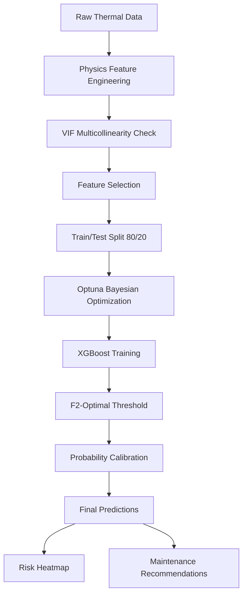

# Technical Architecture: PIML Thermal Hotspot Detection

## System Flow Diagram

## Component Details

### 1. Data Layer
- **Input**: `Thermal Powerline Dataset.xlsx`
- **Records**: 6000 tile-level thermal features
- **Features**: temp_mean, temp_max, temp_std, delta_to_neighbors, hotspot_fraction, edge_gradient, ambient_temp, load_factor
- **Target**: fault_label (0=Normal, 1=Fault)

### 2. Feature Engineering Layer
| Feature | Type | Purpose |
|---------|------|---------|
| delta_T | Physics | Temperature rise above ambient |
| load_norm_severity | Physics | Load-normalized heat (Joule's Law) |
| thermal_gradient_intensity | Physics | Edge heat patterns |
| neighbor_zscore | Statistical | Spatial anomaly score |
| thermal_efficiency | Physics | Heat per unit load |
| relative_hotspot | Composite | Normalized hotspot density |

### 3. Feature Selection Layer
- **VIF Threshold**: 10 (removes multicollinear features)
- **Correlation Check**: |r| > 0.8 flagged

### 4. Model Layer
- **Algorithm**: XGBoost Classifier
- **Cost-Sensitive**: scale_pos_weight = neg/pos ratio
- **Optimization**: Optuna TPE (50 trials)
- **Cross-Validation**: Stratified 5-Fold

### 5. Calibration Layer
- **Method**: Platt Scaling (Sigmoid)
- **Purpose**: Reliable probability estimates

### 6. Decision Layer
- **Threshold**: F2-Score maximizing
- **Metric Focus**: Recall (safety-critical)

## Performance Metrics

| Metric | Why It Matters |
|--------|----------------|
| **Recall** | Minimize missed faults (safety) |
| **F2-Score** | Balance with 2× Recall weight |
| **ROC-AUC** | Overall discrimination |
| **Bootstrap CI** | Uncertainty quantification |

## Output Artifacts
1. Trained XGBoost model
2. Thermal risk probability map
3. Maintenance recommendation labels
4. Calibrated probability estimates
