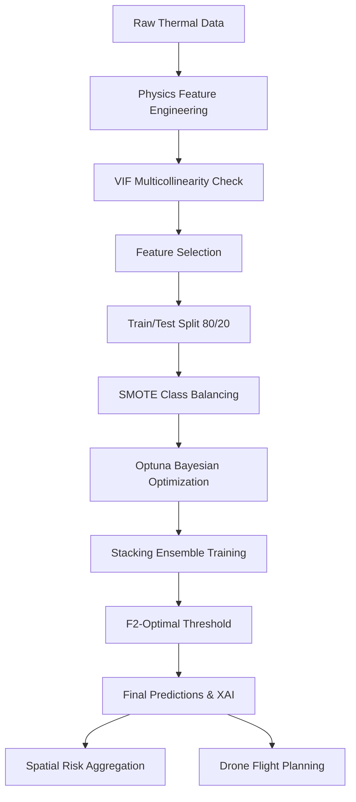

# Technical Architecture: PIML Thermal Hotspot Detection

## System Flow Diagram

```mermaid
flowchart TD
    A[Raw Thermal Data] --> B[Physics Feature Engineering]
    B --> C[VIF Multicollinearity Check]
    C --> D[Feature Selection]
    D --> E[Train/Test Split 80/20]
    E --> F[SMOTE Class Balancing]
    F --> G[Optuna Bayesian Optimization]
    G --> H[Stacking Ensemble Training]
    H --> I[F2-Optimal Threshold]
    I --> J[Final Predictions & XAI]
    J --> K[Spatial Risk Aggregation]
    J --> L[Drone Flight Planning]
```

## Component Details

### 1. Data Layer
- **Input**: `Thermal Powerline Dataset.xlsx`
- **Records**: 6000 tile-level thermal features
- **Features**: temp_mean, temp_max, temp_std, delta_to_neighbors, hotspot_fraction, edge_gradient, ambient_temp, load_factor
- **Target**: fault_label (0=Normal, 1=Fault)

### 2. Feature Engineering Layer
| Feature | Type | Purpose |
|---------|------|---------|
| delta_T | Physics | Temperature rise above ambient |
| load_norm_severity | Physics | Load-normalized heat (Joule's Law) |
| thermal_gradient_intensity | Physics | Edge heat patterns |
| neighbor_zscore | Statistical | Spatial anomaly score |
| relative_hotspot | Composite | Normalized hotspot density |
| combined_severity | Composite | Multi-factor risk index |
| temp_cv | Statistical | Coefficient of variation for temperature |
| load_adj_gradient | Physics | Load-adjusted thermal gradient |

### 3. Feature Selection Layer
- **VIF Threshold**: 10 (removes multicollinear features)
- **Selected Features**: 14 key features retained after VIF analysis

### 4. Model Layer
- **Ensemble Architecture**: Stacking Classifier
- **Base Learners**:
    - XGBoost (Optuna-tuned)
    - RandomForest
    - GradientBoosting
- **Meta Learner**: LogisticRegression
- **Class Balancing**: SMOTE (Synthetic Minority Over-sampling Technique)
- **Optimization**: Optuna TPE (50 trials) for XGBoost
- **Cross-Validation**: Stratified 5-Fold

### 5. Calibration & Decision Layer
- **Threshold**: F2-Score maximizing (0.1324)
- **Metric Focus**: Recall (safety-critical) ensures minimal false negatives

## Performance Metrics

| Metric | Value | Why It Matters |
|--------|-------|----------------|
| **Recall** | 0.8842 | Minimize missed faults (safety) |
| **F2-Score** | 0.8026 | Balance with 2× Recall weight |
| **ROC-AUC** | 0.8709 | Overall discrimination |
| **Precision**| 0.5862 | Acceptable trade-off for safety |

## Output Artifacts
1. **Trained Stacking Model**: Robust prediction engine
2. **Thermal Risk Heatmap**: Spatial visualization of failure probabilities
3. **Maintenance Recommendations**: Categorized severity levels (Critical, High, Moderate, Low)
4. **Drone Flight Sequence**: Prioritized inspection route based on corridor risk
5. **XAI Reports**: LIME local explanations for individual fault flags
